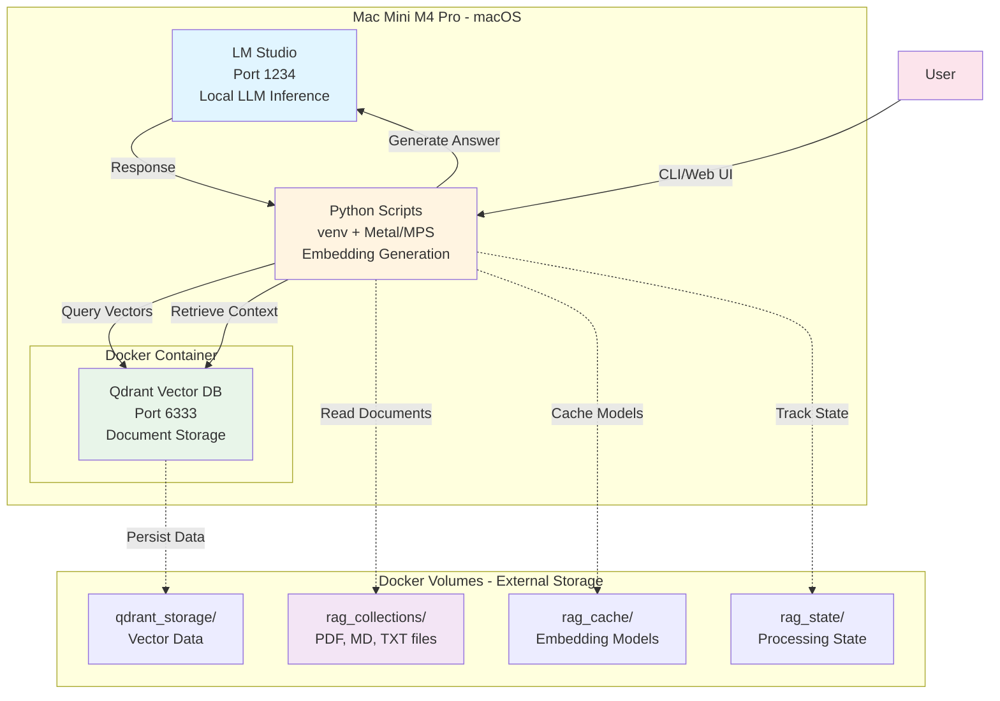
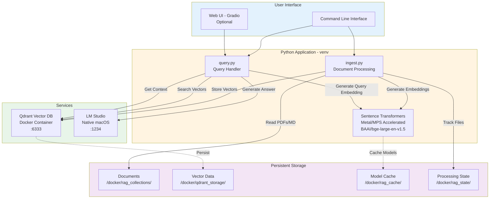

```markdown
# D&D RAG System

A Retrieval-Augmented Generation (RAG) system for querying D&D rulebooks, adventures, and homebrew content using local LLMs with LM Studio.

## Overview

This system eliminates LLM hallucinations by grounding responses in your actual D&D documents. It uses:
- **Qdrant** vector database for document storage
- **Metal Performance Shaders (MPS)** for fast embedding generation on M4 Pro
- **LM Studio** for local LLM inference
- **Incremental processing** to avoid reprocessing unchanged files

## Architecture




A more detailed component diagram:


## Directory Structure

### Code (Development)
```
/Volumes/corsair4tb/Users/stephan/Documents/code/RAG/
├── scripts/
│   ├── ingest.py       # Document ingestion
│   ├── query.py        # Query interface
│   └── web_ui.py       # Gradio web interface (optional)
├── config/
│   └── collections.yaml # Collection definitions
├── venv/               # Python virtual environment
├── requirements.txt    # Python dependencies
├── docker-compose.yml  # Docker orchestration
├── Dockerfile          # Container definition (optional)
├── run.sh             # Convenience script
└── README.md          # This file
```

### Data (Docker Volumes)
```
/Volumes/corsair4tb/Users/stephan/docker/
├── qdrant_storage/      # Vector database storage
├── rag_cache/          # Embedding model cache
├── rag_collections/    # ← PUT YOUR DOCUMENTS HERE
│   └── dnd/
│       ├── core_rules/
│       ├── curse_of_strahd/
│       ├── tomb_of_annihilation/
│       ├── ghosts_of_saltmarsh/
│       └── homebrew/
└── rag_state/          # Tracks processed files
```

## Setup

### Prerequisites
- macOS with Apple Silicon (M1/M2/M4)
- Docker Desktop
- Python 3.11 or 3.12
- LM Studio installed and running

### Initial Installation

1. **Clone/Navigate to project directory:**
```bash
cd /Volumes/corsair4tb/Users/stephan/Documents/code/RAG
```

2. **Create Python virtual environment:**
```bash
python3 -m venv venv
source venv/bin/activate
```

3. **Install dependencies:**
```bash
pip install -r requirements.txt
```

4. **Start Qdrant:**
```bash
docker-compose up -d qdrant
```

5. **Verify Qdrant is running:**
```bash
docker ps | grep qdrant
curl http://localhost:6333/collections
```

## Usage

### Activate Environment

Always activate the virtual environment first:
```bash
cd /Volumes/corsair4tb/Users/stephan/Documents/code/RAG
source venv/bin/activate
```

Set environment variables (optional, defaults work):
```bash
export QDRANT_URL="http://localhost:6333"
export LM_STUDIO_URL="http://localhost:1234/v1"
export TRANSFORMERS_CACHE="/Volumes/corsair4tb/Users/stephan/docker/rag_cache"
export HF_HOME="/Volumes/corsair4tb/Users/stephan/docker/rag_cache"
```

### Adding Documents

1. **Copy PDFs/documents to collection folder:**
```bash
cp ~/Downloads/Players_Handbook.pdf \
   /Volumes/corsair4tb/Users/stephan/docker/rag_collections/dnd/core_rules/
```

2. **Ingest documents:**
```bash
# Process a specific collection
python scripts/ingest.py --collection dnd_core_rules

# Process all collections
python scripts/ingest.py --all

# Force re-process (ignore state tracking)
python scripts/ingest.py --collection dnd_core_rules --force
```

### Querying

#### Search Only (No LLM)
Find relevant passages without AI interpretation:
```bash
python scripts/query.py "grappling rules" --search-only

# Search specific collection
python scripts/query.py "death curse" --collection dnd_tomb_of_annihilation --search-only

# Get more results
python scripts/query.py "spell slots" --search-only --top-k 10
```

#### Query with LLM
Get AI-generated answers based on your documents:
```bash
# Basic query
python scripts/query.py "How does grappling work in D&D 5e?"

# Query specific collection
python scripts/query.py "What is the death curse?" --collection dnd_tomb_of_annihilation

# Query multiple collections
python scripts/query.py "What undead creatures exist?" \
  --collection dnd_core_rules dnd_curse_of_strahd

# Adjust parameters
python scripts/query.py "Explain the magic system" \
  --temperature 0.5 \
  --max-tokens 1500 \
  --top-k 10
```

### Web Interface (Optional)

Launch a browser-based interface:
```bash
python scripts/web_ui.py
```

Then open: http://localhost:7860

## Quick Reference Commands

### Daily Usage
```bash
# Start everything
cd /Volumes/corsair4tb/Users/stephan/Documents/code/RAG
source venv/bin/activate
docker-compose up -d qdrant

# Add new documents
cp ~/Downloads/new_adventure.pdf \
   /Volumes/corsair4tb/Users/stephan/docker/rag_collections/dnd/homebrew/
python scripts/ingest.py --collection dnd_homebrew

# Query
python scripts/query.py "your question here"
```

### Maintenance
```bash
# Check Qdrant status
docker ps | grep qdrant
curl http://localhost:6333/collections

# View processed files
cat /Volumes/corsair4tb/Users/stephan/docker/rag_state/processed_files.json

# Reset processing state (re-process everything)
rm /Volumes/corsair4tb/Users/stephan/docker/rag_state/processed_files.json

# Stop Qdrant
docker-compose down

# View Qdrant logs
docker logs rag-qdrant
```

### Troubleshooting
```bash
# Check Python packages
pip list | grep -E "langchain|qdrant|sentence"

# Test Qdrant connection
python -c "from qdrant_client import QdrantClient; c = QdrantClient('http://localhost:6333'); print(c.get_collections())"

# Check available collections
python -c "from qdrant_client import QdrantClient; c = QdrantClient('http://localhost:6333'); print([col.name for col in c.get_collections().collections])"

# Verify LM Studio is running
curl http://localhost:1234/v1/models
```

## Configuration

### Collections

Edit `config/collections.yaml` to add/modify collections:

```yaml
collections:
  your_new_collection:
    name: "your_new_collection"
    description: "Description of your collection"
    source_path: "/Volumes/corsair4tb/Users/stephan/docker/rag_collections/your_topic/your_collection"
    metadata:
      type: "adventure"  # or "rules", "homebrew", etc.
      game: "dnd5e"
    chunk_size: 1000
    chunk_overlap: 200
    file_patterns: ["*.pdf", "*.txt", "*.md"]
```

### Settings

Key settings in `collections.yaml`:

- **embedding_model**: `BAAI/bge-large-en-v1.5` (excellent for retrieval)
- **embedding_device**: `mps` (uses Metal on Mac)
- **vector_dimension**: `1024` (matches embedding model)
- **batch_size**: `100` (chunks per upload batch)
- **chunk_size**: `1000` (characters per chunk)
- **chunk_overlap**: `200` (overlap between chunks)

## Current Collections

### D&D 5e
- **dnd_core_rules** - Core rulebooks (PHB, DMG, MM)
- **dnd_curse_of_strahd** - Curse of Strahd campaign
- **dnd_tomb_of_annihilation** - Tomb of Annihilation campaign
- **dnd_ghosts_of_saltmarsh** - Ghosts of Saltmarsh campaign
- **dnd_homebrew** - Custom content

## Performance

### Ingestion Speed
- **With Metal (MPS)**: ~23-27 chunks/second
- **CPU only**: ~2-5 chunks/second

### Typical Processing Times
- Small adventure (50 pages): ~2-3 minutes
- Core rulebook (300 pages): ~10-15 minutes
- Large campaign with supplements: ~20-30 minutes

## Adding New Collections

1. **Create directory:**
```bash
mkdir -p /Volumes/corsair4tb/Users/stephan/docker/rag_collections/your_topic/your_collection
```

2. **Add documents:**
```bash
cp ~/Downloads/*.pdf /Volumes/corsair4tb/Users/stephan/docker/rag_collections/your_topic/your_collection/
```

3. **Define in config:**
Edit `config/collections.yaml` and add your collection definition.

4. **Ingest:**
```bash
python scripts/ingest.py --collection your_collection_name
```

## Supported File Types

- **PDF** (`.pdf`) - Most D&D books
- **Markdown** (`.md`) - Notes, guides
- **Text** (`.txt`) - Plain text documents
- **Word** (`.docx`) - Microsoft Word documents

## Tips & Best Practices

### For Best Results

1. **Separate collections by topic** - Don't mix core rules with adventure content
2. **Use descriptive metadata** - Helps with filtering and organization
3. **Lower temperature for facts** - Use 0.1-0.3 for rule lookups
4. **Higher temperature for creativity** - Use 0.7-0.9 for story ideas
5. **Verify with search-only first** - Check what's actually in your knowledge base

### Query Tips

- **Be specific**: "How does grappling work?" vs "grappling"
- **Cite sources**: The system shows which documents were used
- **Use collections**: Narrow searches to relevant collections
- **Adjust top-k**: More sources = more context but slower

### Maintenance

- **Incremental updates**: Just add new files and run ingestion - only new files are processed
- **State tracking**: Processed files are tracked in `/docker/rag_state/processed_files.json`
- **Force refresh**: Use `--force` flag to reprocess everything
- **Check logs**: Use `docker logs rag-qdrant` if issues arise

## Workflow Examples

### Adding a New Adventure

```bash
# 1. Copy files
cp ~/Downloads/new_adventure.pdf \
   /Volumes/corsair4tb/Users/stephan/docker/rag_collections/dnd/homebrew/

# 2. Activate environment
cd /Volumes/corsair4tb/Users/stephan/Documents/code/RAG
source venv/bin/activate

# 3. Ingest
python scripts/ingest.py --collection dnd_homebrew

# 4. Test
python scripts/query.py "What's in the new adventure?" --collection dnd_homebrew --search-only
```

### Preparing for a Session

```bash
# 1. Activate environment
cd /Volumes/corsair4tb/Users/stephan/Documents/code/RAG
source venv/bin/activate

# 2. Make sure services are running
docker-compose up -d qdrant
# Start LM Studio manually

# 3. Test query
python scripts/query.py "Remind me about the main villain" --collection dnd_curse_of_strahd

# 4. Optional: Launch web UI
python scripts/web_ui.py
# Open http://localhost:7860 in browser
```

### Updating Core Rules

```bash
# 1. Add new errata or supplements
cp ~/Downloads/new_errata.pdf \
   /Volumes/corsair4tb/Users/stephan/docker/rag_collections/dnd/core_rules/

# 2. Ingest (only processes new file)
python scripts/ingest.py --collection dnd_core_rules

# 3. Verify
python scripts/query.py "latest errata changes" --collection dnd_core_rules --search-only
```

## Troubleshooting

### "No module named 'langchain'"
```bash
source venv/bin/activate
pip install -r requirements.txt
```

### "Could not connect to Qdrant"
```bash
docker-compose up -d qdrant
docker ps | grep qdrant
```

### "Error querying LLM"
- Make sure LM Studio is running
- Load a model in LM Studio
- Check the server is on port 1234

### "MPS not available"
- This is normal in Docker containers
- For native execution, make sure you're on Apple Silicon Mac

### Slow ingestion
- Check if Metal is being used: Look for "✓ Using Metal Performance Shaders"
- If using CPU, it's 4-10x slower but still works
- Consider processing overnight for large collections

### "No documents found"
- Check the path in `config/collections.yaml`
- Verify files exist: `ls -la /Volumes/corsair4tb/Users/stephan/docker/rag_collections/dnd/your_collection/`
- Check file patterns match your files (`.pdf`, `.md`, etc.)

## Future Enhancements

- [ ] Web UI with Gradio (script ready: `web_ui.py`)
- [ ] Open WebUI integration for full chat interface
- [ ] Watch mode for automatic ingestion
- [ ] Support for more file types (EPUB, HTML)
- [ ] Multi-language support
- [ ] Fine-tuned embedding models for RPG content
- [ ] Automatic chunking optimization
- [ ] Query history and favorites

## Technical Details

### Embedding Model
- **Model**: BAAI/bge-large-en-v1.5
- **Dimensions**: 1024
- **Performance**: State-of-the-art retrieval quality
- **Size**: ~1.34GB (cached after first download)

### Vector Database
- **Database**: Qdrant
- **Distance Metric**: Cosine similarity
- **Storage**: Persistent in Docker volume

### LLM Integration
- **Interface**: OpenAI-compatible API
- **Backend**: LM Studio (local inference)
- **Models**: Any model loaded in LM Studio

## Resources

- [Qdrant Documentation](https://qdrant.tech/documentation/)
- [LangChain Documentation](https://python.langchain.com/)
- [LM Studio](https://lmstudio.ai/)
- [Sentence Transformers](https://www.sbert.net/)

## License

Personal use for D&D campaign management.

## Credits

Built with:
- Qdrant vector database
- LangChain for document processing
- Sentence Transformers for embeddings
- LM Studio for local LLM inference
- Python 3.12 on macOS

---

**Last Updated**: 2026-02-02
**Version**: 1.0
**System**: Mac Mini M4 Pro, 64GB RAM
```